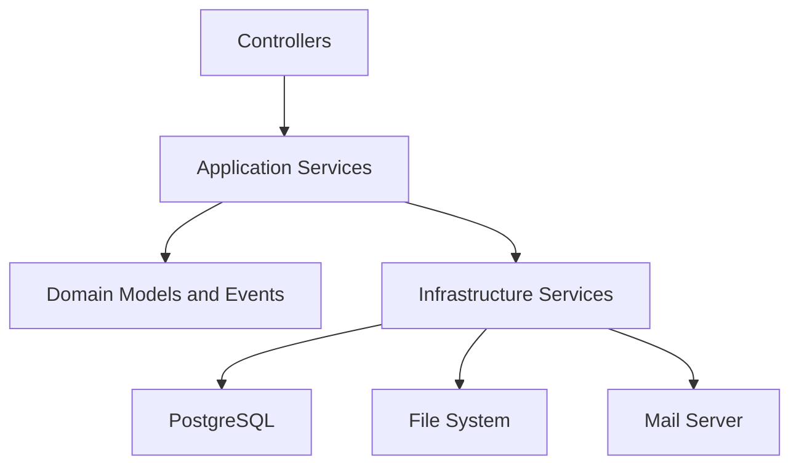

# Backup Manager

API para execução, agendamento e auditoria de rotinas de backup e restauração de arquivos, com foco em operação controlada, segurança de acesso e execução assíncrona.

## Visão Geral

O projeto foi construído como um serviço backend em Java com Spring Boot para atender três necessidades principais:

- iniciar backups sob demanda com acompanhamento de progresso e histórico
- agendar execuções recorrentes e pontuais
- restaurar backups completos ou seletivos com validação de caminhos e trilha operacional

Além da execução das rotinas, a aplicação também oferece:

- controle de tarefas em andamento
- persistência de histórico em PostgreSQL
- notificações por e-mail
- endpoints operacionais de saúde, armazenamento e logs
- proteção por autenticação e autorização para superfícies administrativas e operacionais

## Objetivos de Projeto

O serviço foi estruturado para operar como uma API de backend com responsabilidades bem definidas:

- camada HTTP responsável por entrada, resposta e contrato da API
- camada de aplicação concentrando regras de orquestração
- camada de domínio representando tarefas, eventos e estados do processo
- camada de infraestrutura cuidando de persistência, segurança, agendamento, logging e integração com o sistema de arquivos

O desenho atual prioriza:

- execução assíncrona real para backups e restaurações
- separação entre operações administrativas e operacionais
- proteção de paths com allowlist configurável
- persistência consistente do estado final das tarefas
- uso de DTOs para reduzir exposição de entidades internas

## Principais Funcionalidades

### Backups

- início manual de backup
- pausa, retomada e cancelamento de tarefas
- acompanhamento de progresso
- histórico com consulta, busca e estatísticas
- prevenção de execução duplicada para o mesmo par origem/destino

### Restauração

- pré-visualização da estrutura do backup
- restauração completa
- restauração seletiva por arquivos e diretórios
- cancelamento e consulta de status
- histórico geral e histórico por backup de origem

### Agendamento

- cadastro de configurações recorrentes
- validação de expressões cron
- execução agendada dinâmica
- agendamento pontual de tarefas únicas
- disparo imediato de configurações válidas

### Operação e Observabilidade

- health checks da aplicação e do banco
- consulta de uso de armazenamento
- leitura controlada de logs de warning
- notificações por e-mail para eventos de backup e restauração

## Arquitetura

### Visão em camadas



### Organização do código

```text
src/main/java/com/backup_manager
├── application
│   ├── controller
│   ├── dto
│   ├── listener
│   ├── progress
│   └── service
├── domain
│   ├── event
│   ├── exception
│   ├── model
│   └── service
└── infrastructure
    ├── config
    ├── logging
    ├── persistence
    ├── storage
    └── validation
```

### Componentes centrais

- `application/controller`: expõe a API REST e aplica o contrato externo do sistema
- `application/service`: concentra a orquestração de backup, restore, validação, histórico e agendamento
- `domain/model`: representa tarefas de backup, restore e configurações agendadas
- `domain/event`: publica eventos de início, conclusão, falha e cancelamento
- `infrastructure/persistence`: repositórios JPA para PostgreSQL
- `infrastructure/storage`: operações físicas de cópia e restauração de arquivos
- `infrastructure/config`: segurança, async, scheduler, serialização, CORS e bootstrap

### Fluxo de execução

1. o controller recebe a requisição e valida o payload
2. a camada de aplicação valida origem, destino, espaço, cron e restrições de segurança
3. a tarefa é persistida com estado inicial
4. a execução segue por executor gerenciado pelo Spring
5. progresso, status final e histórico são gravados no banco
6. eventos de domínio disparam notificações e integrações internas

## Stack Técnica

- Java 21
- Spring Boot 4.0.1
- Spring Web MVC
- Spring Data JPA
- Spring Security
- PostgreSQL
- Flyway
- Jakarta Validation
- Spring Mail
- Spring Retry
- Maven
- Docker e Docker Compose
- GitHub Actions

## Segurança

O projeto já incorpora uma camada de segurança operacional importante:

- autenticação HTTP Basic
- sessão stateless
- separação de papéis entre `ADMIN` e `OPERATOR`
- bloqueio de endpoints administrativos para usuários operacionais
- validação de paths com roots permitidas por configuração
- `spring.jpa.open-in-view=false`
- respostas mais enxutas para reduzir exposição de detalhes internos

### Regras atuais de acesso

- público:
  - `GET /api/health/application`
- administrativo:
  - `/api/health/**`
  - `/api/system/**`
  - `/api/logs/**`
  - `/api/backup/config/**`
  - `/api/backup/scheduler/**`
  - `/api/backup/notifications/**`
- operacional e administrativo:
  - `/api/backup/**`
  - `/api/restore/**`

### Observações de segurança

- as senhas default não devem ser usadas fora de ambiente controlado
- em produção, configure `APP_SECURITY_USERNAME`, `APP_SECURITY_PASSWORD` e, se aplicável, as credenciais do operador
- a propriedade `APP_SECURITY_ALLOWED_PATH_ROOTS` deve restringir explicitamente as áreas autorizadas do filesystem

## Modelo de Dados

O banco é gerenciado com Flyway e o Hibernate roda com `ddl-auto=validate`.

Migrações versionadas disponíveis:

- `V1__create_backup_tasks_table.sql`
- `V2__add_scheduled_backups_timestamps.sql`
- `V4__create_restore_tasks_table.sql`

Entidades principais:

- `BackupTask`: histórico e ciclo de vida de execuções de backup
- `RestoreTask`: histórico e ciclo de vida de restaurações
- `ScheduledBackupEntity`: configuração recorrente de backup agendado

## Estrutura de Execução Assíncrona

Os fluxos assíncronos são executados por beans gerenciados pelo Spring:

- `backupDispatchExecutor`: despacho de rotinas assíncronas
- `backupTaskExecutor`: processamento das tarefas de backup
- `backupOneTimeScheduler`: agendamento de execuções pontuais

Essa abordagem elimina pools manuais dispersos em services e melhora o encerramento controlado da aplicação.

## Como Executar Localmente

### Pré-requisitos

- Java 21
- Maven 3.9+
- Docker e Docker Compose
- PostgreSQL, caso não use o `docker-compose.yml`

### 1. Subir o banco com Docker Compose

```bash
docker compose up -d
```

O compose sobe:

- PostgreSQL 15
- database `backup_manager`
- usuário `postgres`
- senha `postgres`

### 2. Configurar variáveis de ambiente

Você pode usar variáveis de ambiente do sistema ou um arquivo `.env` na raiz do projeto.

Exemplo:

```env
DB_HOST=localhost
DB_PORT=5432
DB_NAME=backup_manager
DB_USERNAME=postgres
DB_PASSWORD=postgres

APP_PORT=8080

APP_SECURITY_USERNAME=admin
APP_SECURITY_PASSWORD=strong-admin-password
APP_SECURITY_ROLE=ADMIN

APP_SECURITY_OPERATOR_ENABLED=true
APP_SECURITY_OPERATOR_USERNAME=operator
APP_SECURITY_OPERATOR_PASSWORD=strong-operator-password
APP_SECURITY_OPERATOR_ROLE=OPERATOR

APP_SECURITY_ALLOWED_PATH_ROOTS=C:\Backups,C:\Dados

MAIL_HOST=smtp.example.com
MAIL_PORT=465
MAIL_USERNAME=mailer@example.com
MAIL_PASSWORD=secret

NOTIFICATION_ENABLED=true
NOTIFICATION_EMAIL_FROM=backup@example.com
NOTIFICATION_EMAIL_RECIPIENTS=ops@example.com,infra@example.com
NOTIFICATION_NOTIFY_SUCCESS=true
NOTIFICATION_NOTIFY_FAILURE=true
```

### 3. Executar a aplicação

```bash
mvn spring-boot:run
```

Ou, para gerar o artefato:

```bash
mvn clean package
java -jar target/*.jar
```

### Perfis disponíveis

- padrão: ambiente normal com validações de segurança ativas
- `dev`: permite `app.security.allow-default-password=true`
- `test`: usa `ddl-auto=create-drop` e libera senha default para execução de testes

Para ativar um perfil:

```bash
mvn spring-boot:run -Dspring-boot.run.profiles=dev
```

## Execução com Docker

### Build da imagem

```bash
docker build -t backup-manager:local .
```

### Run

```bash
docker run --rm -p 8080:8080 \
  -e DB_HOST=host.docker.internal \
  -e DB_PORT=5432 \
  -e DB_NAME=backup_manager \
  -e DB_USERNAME=postgres \
  -e DB_PASSWORD=postgres \
  -e APP_SECURITY_USERNAME=admin \
  -e APP_SECURITY_PASSWORD=strong-admin-password \
  -e APP_SECURITY_ALLOWED_PATH_ROOTS=/data \
  backup-manager:local
```

## Configuração por Variáveis de Ambiente

| Variável | Finalidade | Valor padrão |
| --- | --- | --- |
| `DB_HOST` | host do PostgreSQL | `localhost` |
| `DB_PORT` | porta do PostgreSQL | `5432` |
| `DB_NAME` | nome do banco | `backup_manager` |
| `DB_USERNAME` | usuário do banco | `postgres` |
| `DB_PASSWORD` | senha do banco | vazio |
| `APP_PORT` | porta HTTP da aplicação | `8080` |
| `APP_SECURITY_USERNAME` | usuário administrativo | `admin` |
| `APP_SECURITY_PASSWORD` | senha administrativa | `change-me-now` |
| `APP_SECURITY_ROLE` | role administrativa | `ADMIN` |
| `APP_SECURITY_OPERATOR_ENABLED` | habilita usuário operacional | `false` |
| `APP_SECURITY_OPERATOR_USERNAME` | usuário operacional | `operator` |
| `APP_SECURITY_OPERATOR_PASSWORD` | senha operacional | `change-me-operator` |
| `APP_SECURITY_OPERATOR_ROLE` | role operacional | `OPERATOR` |
| `APP_SECURITY_ALLOW_DEFAULT_PASSWORD` | permite subida com senha default | `false` |
| `APP_SECURITY_ALLOWED_PATH_ROOTS` | allowlist de roots permitidas | `${user.home}` |
| `NOTIFICATION_ENABLED` | habilita notificações | `false` |
| `NOTIFICATION_EMAIL_FROM` | remetente de e-mail | `noreply-test@engefort.com.br` |
| `NOTIFICATION_EMAIL_RECIPIENTS` | lista de destinatários | `dev-test@engefort.com.br` |
| `NOTIFICATION_NOTIFY_SUCCESS` | notifica sucesso | `false` |
| `NOTIFICATION_NOTIFY_FAILURE` | notifica falha | `false` |
| `MAIL_HOST` | host SMTP | `smtp.test.local` |
| `MAIL_PORT` | porta SMTP | `465` |
| `MAIL_USERNAME` | usuário SMTP | `test@test.local` |
| `MAIL_PASSWORD` | senha SMTP | `dummy-password` |

## Endpoints Principais

### Backup

- `POST /api/backup/start`
- `GET /api/backup/progress`
- `POST /api/backup/{taskId}/pause`
- `POST /api/backup/{taskId}/resume`
- `POST /api/backup/{taskId}/cancel`
- `GET /api/backup/{taskId}/status`
- `GET /api/backup/active`
- `GET /api/backup/history`
- `GET /api/backup/history/search`
- `GET /api/backup/history/stats`
- `GET /api/backup/history/recent`

### Restore

- `GET /api/backup/{id}/restore/preview`
- `POST /api/backup/{id}/restore`
- `POST /api/backup/{id}/restore/selective`
- `POST /api/restore/{taskId}/cancel`
- `GET /api/restore/{taskId}/status`
- `GET /api/restore/history`
- `GET /api/restore/recent`
- `GET /api/backup/{id}/restore/history`

### Configuração e Agendamento

- `POST /api/backup/config`
- `GET /api/backup/config`
- `GET /api/backup/config/{id}`
- `PATCH /api/backup/config/{id}/toggle`
- `DELETE /api/backup/config/{id}`
- `POST /api/backup/config/validate-cron`
- `GET /api/backup/config/cron-templates`
- `GET /api/backup/scheduler/status`
- `GET /api/backup/scheduler/info`
- `POST /api/backup/scheduler/schedule-once`
- `DELETE /api/backup/scheduler/schedule/{taskId}/cancel`
- `GET /api/backup/scheduler/schedule/pending`
- `POST /api/backup/scheduler/execute-now`
- `GET /api/backup/scheduler/health`

### Operação

- `GET /api/health/application`
- `GET /api/health/database`
- `GET /api/system/storage`
- `GET /api/logs`
- `GET /api/logs/warnings`
- `GET /api/backup/notifications/settings`
- `POST /api/backup/notifications/test`

## Exemplos de Uso

### Iniciar um backup

```bash
curl -u admin:strong-admin-password \
  -X POST http://localhost:8080/api/backup/start \
  -H "Content-Type: application/json" \
  -d '{
    "sources": ["C:\\Dados"],
    "destinations": ["C:\\Backups"],
    "compress": false
  }'
```

### Criar configuração recorrente

```bash
curl -u admin:strong-admin-password \
  -X POST http://localhost:8080/api/backup/config \
  -H "Content-Type: application/json" \
  -d '{
    "name": "Backup diário",
    "sources": ["C:\\Dados"],
    "destinations": ["C:\\Backups"],
    "cronExpression": "0 0 2 * * *",
    "enabled": true
  }'
```

### Solicitar restauração seletiva

```bash
curl -u operator:strong-operator-password \
  -X POST http://localhost:8080/api/backup/10/restore/selective \
  -H "Content-Type: application/json" \
  -d '{
    "restoreDestination": "C:\\Restore",
    "selectedFiles": ["documentos/financeiro/relatorio.xlsx"]
  }'
```

## Qualidade, Testes e Build

### Comandos úteis

```bash
mvn validate
mvn clean compile
mvn test
mvn jacoco:report
mvn package -DskipTests
```

### Testes existentes

O projeto já possui cobertura automatizada para áreas críticas como:

- validação de segurança de paths
- validação centralizada de requisições de backup
- regras de segurança de acesso por papel
- bootstrap da aplicação

## CI/CD

Os workflows do repositório estão organizados da seguinte forma:

- `feature-branch-ci.yml`
  - build rápido em branches de trabalho
- `pr-quality-gates.yml`
  - validação completa com PostgreSQL, compilação, testes, cobertura e artefatos
- `container-registry.yml`
  - build e publicação da imagem no GitHub Container Registry para `main` e `master`
- `version-release.yml`
  - empacotamento e criação de release GitHub a partir de tags `v*.*.*`

## Logging e Operação

- logs da aplicação usam `INFO` para o namespace `com.backup_manager`
- warnings operacionais podem ser consultados por endpoint protegido
- o endpoint `/actuator/health` é usado pelo `HEALTHCHECK` da imagem Docker
- o endpoint público recomendado para monitoramento externo é `GET /api/health/application`

## Boas Práticas Operacionais

- definir roots restritas em `APP_SECURITY_ALLOWED_PATH_ROOTS`
- separar credenciais de admin e operador
- usar banco dedicado para cada ambiente
- não subir o serviço em produção com senhas default
- restringir o acesso ao SMTP e aos volumes de destino
- manter rotação e retenção de backups alinhadas com a política do ambiente

## Limitações Conhecidas

- a autenticação atual é baseada em usuários em memória e HTTP Basic
- o agendamento depende da disponibilidade contínua da aplicação
- a cópia e a restauração operam sobre filesystem local acessível pelo processo da aplicação

## Licença

Defina a licença do projeto de acordo com a política do repositório antes de uso externo ou distribuição.
