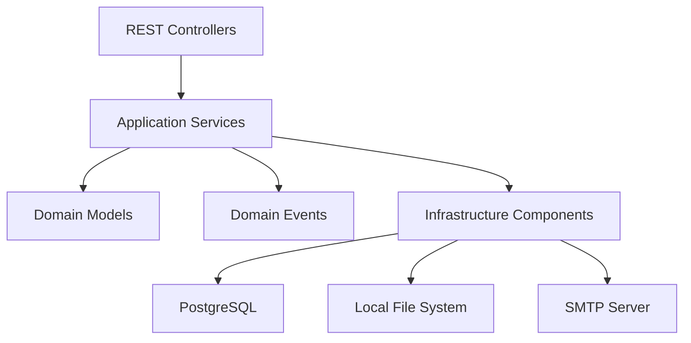

# Backup Manager

API backend para execução, agendamento e auditoria de rotinas de backup e restauração de arquivos. O projeto foi construído para operar com controle de acesso, validação de caminhos, processamento assíncrono e histórico persistido em banco.

## 📌 Sobre o projeto

O `Backup Manager` centraliza operações que normalmente acabam espalhadas entre scripts manuais, tarefas do sistema operacional e rotinas administrativas sem rastreabilidade. A proposta aqui é transformar esse processo em um serviço HTTP estruturado, com regras explícitas, segurança de acesso e visibilidade operacional.

Na prática, a aplicação resolve quatro frentes:

- execução de backups sob demanda
- agendamento de backups recorrentes e pontuais
- restauração completa ou seletiva de conteúdo
- histórico, status, progresso e notificações operacionais

O projeto foi implementado em Java com Spring Boot, adotando uma arquitetura em camadas para separar contrato HTTP, regras de aplicação, modelo de domínio e infraestrutura.

## 🧱 O que o sistema faz

### Backups

- inicia backups manualmente via API
- impede execução concorrente duplicada para a mesma origem e destino
- acompanha progresso em tempo real
- permite pausar, retomar e cancelar tarefas
- mantém histórico consultável com busca e estatísticas

### Restauração

- gera pré-visualização do conteúdo disponível no backup
- executa restauração completa
- executa restauração seletiva por arquivo ou diretório
- registra histórico de restauração por tarefa e por backup de origem
- permite cancelamento de tarefas em andamento

### Agendamento

- cadastra rotinas recorrentes baseadas em cron
- valida expressões cron antes da persistência
- agenda execuções únicas para um horário futuro
- permite disparo imediato de configurações válidas
- recarrega agendamentos ativos durante o ciclo de vida da aplicação

### Operação

- expõe health checks da aplicação e do banco
- informa métricas de armazenamento
- centraliza warnings operacionais
- envia notificações por e-mail para eventos relevantes

## 🏗️ Arquitetura

O projeto segue uma divisão clara entre entrada HTTP, orquestração, domínio e infraestrutura.



### Estrutura do código

```text
src/main/java/com/backup_manager
├── application
│   ├── controller
│   ├── dto
│   ├── listener
│   ├── progress
│   └── service
├── domain
│   ├── event
│   ├── exception
│   ├── model
│   └── service
└── infrastructure
    ├── config
    ├── logging
    ├── persistence
    ├── storage
    └── validation
```

### Papéis das camadas

- `application/controller`
  Expõe os endpoints REST, traduz a entrada HTTP e devolve respostas adequadas ao contrato da API.

- `application/service`
  Orquestra execução de backup, restore, histórico, validação, notificações e agendamento.

- `domain/model`
  Representa entidades como `BackupTask`, `RestoreTask` e `ScheduledBackupEntity`, além dos estados do processo.

- `domain/event`
  Modela eventos de início, conclusão, falha e cancelamento, desacoplando execução e reação operacional.

- `infrastructure/persistence`
  Implementa os repositórios JPA usados para persistência em PostgreSQL.

- `infrastructure/storage`
  Encapsula as operações físicas de leitura, cópia e restauração de arquivos.

- `infrastructure/config`
  Reúne segurança, serialização, execução assíncrona, scheduler, CORS e verificações de bootstrap.

## ⚙️ Decisões técnicas relevantes

Algumas decisões estruturais definem o comportamento atual do serviço:

- uso de `Spring Security` com autenticação HTTP Basic e autorização por papel
- `spring.jpa.open-in-view=false` para evitar acesso lazy implícito na camada web
- `ddl-auto=validate` com `Flyway` como responsável pelas migrações
- execução assíncrona via executores gerenciados pelo Spring
- validação centralizada de requisições de backup
- proteção de filesystem baseada em allowlist configurável
- uso de DTOs para reduzir exposição de entidades internas nos endpoints

## 🔐 Segurança

O sistema não foi desenhado como uma API pública aberta. Ele assume uso administrativo ou operacional controlado.

### Modelo de autenticação e autorização

- autenticação por HTTP Basic
- sessão stateless
- usuário administrativo com role `ADMIN`
- usuário operacional opcional com role `OPERATOR`

### Regras de acesso atuais

**Público**

- `GET /api/health/application`

**Apenas `ADMIN`**

- `/api/health/**`
- `/api/system/**`
- `/api/logs/**`
- `/api/backup/config/**`
- `/api/backup/scheduler/**`
- `/api/backup/notifications/**`

**`ADMIN` ou `OPERATOR`**

- `/api/backup/**`
- `/api/restore/**`

### Proteção de caminhos

As operações de backup e restauração não aceitam paths arbitrários sem controle. O projeto utiliza uma allowlist definida em `APP_SECURITY_ALLOWED_PATH_ROOTS` e aplica validações para:

- impedir path traversal
- bloquear caminhos fora das roots permitidas
- restringir escrita em destinos não autorizados
- evitar manipulação acidental de áreas sensíveis do host

### Recomendação operacional

Não use os valores default de credenciais fora de ambiente controlado. Em produção, configure no mínimo:

- `APP_SECURITY_USERNAME`
- `APP_SECURITY_PASSWORD`
- `APP_SECURITY_ALLOWED_PATH_ROOTS`

Se houver separação entre usuários administrativos e operacionais:

- `APP_SECURITY_OPERATOR_ENABLED=true`
- `APP_SECURITY_OPERATOR_USERNAME`
- `APP_SECURITY_OPERATOR_PASSWORD`

## 🧠 Fluxo de execução

### Fluxo de backup

1. o controller recebe a requisição
2. a entrada é validada
3. a aplicação verifica origem, destino, espaço disponível e regras de segurança
4. a tarefa é persistida com estado inicial
5. a execução segue por um executor assíncrono gerenciado pelo Spring
6. progresso e estado final são persistidos
7. eventos de domínio disparam listeners e notificações

### Fluxo de restauração

1. o backup de origem é localizado
2. o destino solicitado é validado contra a allowlist
3. o modo de restauração é definido como completo ou seletivo
4. a tarefa é persistida
5. a restauração roda de forma assíncrona
6. histórico, duração e resultado ficam disponíveis para consulta

### Fluxo de agendamento

1. a configuração é validada
2. a expressão cron ou agendamento único é persistido
3. o scheduler carrega as tarefas ativas
4. no momento da execução, a aplicação revalida a operação
5. o backup é disparado e acompanhado como tarefa normal

## 🗃️ Persistência e modelo de dados

O projeto usa PostgreSQL como banco principal e Flyway para versionamento de schema.

### Entidades centrais

- `BackupTask`
  Registro de execução de backup, com status, progresso, origem, destino, duração e resultados.

- `RestoreTask`
  Registro de execução de restauração, incluindo tipo de restore, destino, resultado e histórico.

- `ScheduledBackupEntity`
  Configuração recorrente de backup agendado, com cron, estado de ativação e metadados operacionais.

### Migrações existentes

- `V1__create_backup_tasks_table.sql`
- `V2__add_scheduled_backups_timestamps.sql`
- `V4__create_restore_tasks_table.sql`

## 🚀 Stack técnica

- Java 21
- Spring Boot 4.0.1
- Spring Web MVC
- Spring Data JPA
- Spring Security
- Flyway
- PostgreSQL
- Jakarta Validation
- Spring Mail
- Spring Retry
- Maven
- Docker
- Docker Compose
- GitHub Actions

## ▶️ Como executar localmente

### Pré-requisitos

- Java 21
- Maven 3.9 ou superior
- Docker e Docker Compose

### 1. Subir o banco de dados

O repositório já inclui `docker-compose.yml` para o PostgreSQL local:

```bash
docker compose up -d
```

Serviço provisionado:

- imagem `postgres:15-alpine`
- banco `backup_manager`
- usuário `postgres`
- senha `postgres`

### 2. Configurar ambiente

A aplicação lê variáveis do sistema e também aceita um arquivo `.env` na raiz do projeto.

Exemplo:

```env
DB_HOST=localhost
DB_PORT=5432
DB_NAME=backup_manager
DB_USERNAME=postgres
DB_PASSWORD=postgres

APP_PORT=8080

APP_SECURITY_USERNAME=admin
APP_SECURITY_PASSWORD=strong-admin-password
APP_SECURITY_ROLE=ADMIN

APP_SECURITY_OPERATOR_ENABLED=true
APP_SECURITY_OPERATOR_USERNAME=operator
APP_SECURITY_OPERATOR_PASSWORD=strong-operator-password
APP_SECURITY_OPERATOR_ROLE=OPERATOR

APP_SECURITY_ALLOWED_PATH_ROOTS=C:\Backups,C:\Dados

MAIL_HOST=smtp.example.com
MAIL_PORT=465
MAIL_USERNAME=mailer@example.com
MAIL_PASSWORD=secret

NOTIFICATION_ENABLED=true
NOTIFICATION_EMAIL_FROM=backup@example.com
NOTIFICATION_EMAIL_RECIPIENTS=ops@example.com,infra@example.com
NOTIFICATION_NOTIFY_SUCCESS=true
NOTIFICATION_NOTIFY_FAILURE=true
```

### 3. Executar a aplicação

```bash
mvn spring-boot:run
```

Para gerar o pacote:

```bash
mvn clean package
java -jar target/*.jar
```

### Perfis

- padrão
  Operação normal com regras de segurança completas.

- `dev`
  Permite subida com senha default para facilitar desenvolvimento local.

- `test`
  Usa `create-drop` e flexibiliza o ambiente de teste automatizado.

Ativação de perfil:

```bash
mvn spring-boot:run -Dspring-boot.run.profiles=dev
```

## 🐳 Docker

### Build

```bash
docker build -t backup-manager:local .
```

### Run

```bash
docker run --rm -p 8080:8080 \
  -e DB_HOST=host.docker.internal \
  -e DB_PORT=5432 \
  -e DB_NAME=backup_manager \
  -e DB_USERNAME=postgres \
  -e DB_PASSWORD=postgres \
  -e APP_SECURITY_USERNAME=admin \
  -e APP_SECURITY_PASSWORD=strong-admin-password \
  -e APP_SECURITY_ALLOWED_PATH_ROOTS=/data \
  backup-manager:local
```

### Observações sobre a imagem

- build multi-stage com Maven e Eclipse Temurin 21
- runtime em `eclipse-temurin:21-jre-alpine`
- healthcheck baseado em `/actuator/health`
- execução com usuário não root

## 🧾 Variáveis de ambiente

| Variável | Finalidade | Valor padrão |
| --- | --- | --- |
| `DB_HOST` | host do PostgreSQL | `localhost` |
| `DB_PORT` | porta do PostgreSQL | `5432` |
| `DB_NAME` | nome do banco | `backup_manager` |
| `DB_USERNAME` | usuário do banco | `postgres` |
| `DB_PASSWORD` | senha do banco | vazio |
| `APP_PORT` | porta HTTP da aplicação | `8080` |
| `APP_SECURITY_USERNAME` | usuário administrativo | `admin` |
| `APP_SECURITY_PASSWORD` | senha administrativa | `change-me-now` |
| `APP_SECURITY_ROLE` | role administrativa | `ADMIN` |
| `APP_SECURITY_OPERATOR_ENABLED` | habilita usuário operacional | `false` |
| `APP_SECURITY_OPERATOR_USERNAME` | usuário operacional | `operator` |
| `APP_SECURITY_OPERATOR_PASSWORD` | senha operacional | `change-me-operator` |
| `APP_SECURITY_OPERATOR_ROLE` | role operacional | `OPERATOR` |
| `APP_SECURITY_ALLOW_DEFAULT_PASSWORD` | permite senha default | `false` |
| `APP_SECURITY_ALLOWED_PATH_ROOTS` | roots permitidas para filesystem | `${user.home}` |
| `NOTIFICATION_ENABLED` | habilita notificações | `false` |
| `NOTIFICATION_EMAIL_FROM` | remetente dos e-mails | `noreply-test@engefort.com.br` |
| `NOTIFICATION_EMAIL_RECIPIENTS` | destinatários | `dev-test@engefort.com.br` |
| `NOTIFICATION_NOTIFY_SUCCESS` | envia notificação de sucesso | `false` |
| `NOTIFICATION_NOTIFY_FAILURE` | envia notificação de falha | `false` |
| `MAIL_HOST` | host SMTP | `smtp.test.local` |
| `MAIL_PORT` | porta SMTP | `465` |
| `MAIL_USERNAME` | usuário SMTP | `test@test.local` |
| `MAIL_PASSWORD` | senha SMTP | `dummy-password` |

## 🌐 Endpoints principais

### Backup

- `POST /api/backup/start`
- `GET /api/backup/progress`
- `POST /api/backup/{taskId}/pause`
- `POST /api/backup/{taskId}/resume`
- `POST /api/backup/{taskId}/cancel`
- `GET /api/backup/{taskId}/status`
- `GET /api/backup/active`
- `GET /api/backup/history`
- `GET /api/backup/history/search`
- `GET /api/backup/history/stats`
- `GET /api/backup/history/recent`

### Restore

- `GET /api/backup/{id}/restore/preview`
- `POST /api/backup/{id}/restore`
- `POST /api/backup/{id}/restore/selective`
- `POST /api/restore/{taskId}/cancel`
- `GET /api/restore/{taskId}/status`
- `GET /api/restore/history`
- `GET /api/restore/recent`
- `GET /api/backup/{id}/restore/history`

### Configuração e scheduler

- `POST /api/backup/config`
- `GET /api/backup/config`
- `GET /api/backup/config/{id}`
- `PATCH /api/backup/config/{id}/toggle`
- `DELETE /api/backup/config/{id}`
- `POST /api/backup/config/validate-cron`
- `GET /api/backup/config/cron-templates`
- `GET /api/backup/scheduler/status`
- `GET /api/backup/scheduler/info`
- `POST /api/backup/scheduler/schedule-once`
- `DELETE /api/backup/scheduler/schedule/{taskId}/cancel`
- `GET /api/backup/scheduler/schedule/pending`
- `POST /api/backup/scheduler/execute-now`
- `GET /api/backup/scheduler/health`

### Operação

- `GET /api/health/application`
- `GET /api/health/database`
- `GET /api/system/storage`
- `GET /api/logs`
- `GET /api/logs/warnings`
- `GET /api/backup/notifications/settings`
- `POST /api/backup/notifications/test`

## 💡 Exemplos de uso

### Iniciar um backup

```bash
curl -u admin:strong-admin-password \
  -X POST http://localhost:8080/api/backup/start \
  -H "Content-Type: application/json" \
  -d '{
    "sources": ["C:\\Dados"],
    "destinations": ["C:\\Backups"],
    "compress": false
  }'
```

### Criar uma configuração recorrente

```bash
curl -u admin:strong-admin-password \
  -X POST http://localhost:8080/api/backup/config \
  -H "Content-Type: application/json" \
  -d '{
    "name": "Backup diário",
    "sources": ["C:\\Dados"],
    "destinations": ["C:\\Backups"],
    "cronExpression": "0 0 2 * * *",
    "enabled": true
  }'
```

### Solicitar restauração seletiva

```bash
curl -u operator:strong-operator-password \
  -X POST http://localhost:8080/api/backup/10/restore/selective \
  -H "Content-Type: application/json" \
  -d '{
    "restoreDestination": "C:\\Restore",
    "selectedFiles": ["documentos/financeiro/relatorio.xlsx"]
  }'
```

## 🧪 Testes e build

### Comandos úteis

```bash
mvn validate
mvn clean compile
mvn test
mvn jacoco:report
mvn package -DskipTests
```

### Cobertura atual

O projeto já possui testes para áreas sensíveis da aplicação, incluindo:

- regras de segurança por papel
- validação de paths
- validação centralizada de requisições de backup
- bootstrap da aplicação

## 🔄 CI/CD

O repositório possui workflows separados por responsabilidade:

- `feature-branch-ci.yml`
  Build rápido para branches de trabalho.

- `pr-quality-gates.yml`
  Validação mais completa com PostgreSQL, compilação, testes, cobertura e upload de artefatos.

- `container-registry.yml`
  Build e publicação da imagem no GitHub Container Registry para `main` e `master`.

- `version-release.yml`
  Empacotamento e criação de release GitHub a partir de tags versionadas.

## 📂 Observabilidade e operação

- logs da aplicação usam nível `INFO` para o namespace `com.backup_manager`
- warnings operacionais podem ser consultados por endpoint protegido
- a imagem Docker usa `/actuator/health` como healthcheck
- para monitoramento externo simples, o endpoint público recomendado é `GET /api/health/application`

## Boas práticas de uso

- defina roots mínimas em `APP_SECURITY_ALLOWED_PATH_ROOTS`
- separe credenciais de administração e operação
- mantenha o banco isolado por ambiente
- não suba o serviço em produção com senhas default
- limite o acesso do processo aos diretórios realmente necessários
- proteja as credenciais SMTP fora do código e do repositório

## Limitações atuais

- a autenticação ainda é baseada em usuários em memória e HTTP Basic
- o agendamento depende da aplicação estar disponível
- as rotinas operam sobre filesystem local acessível pelo processo da aplicação
