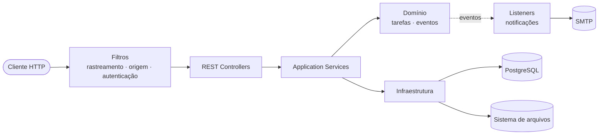
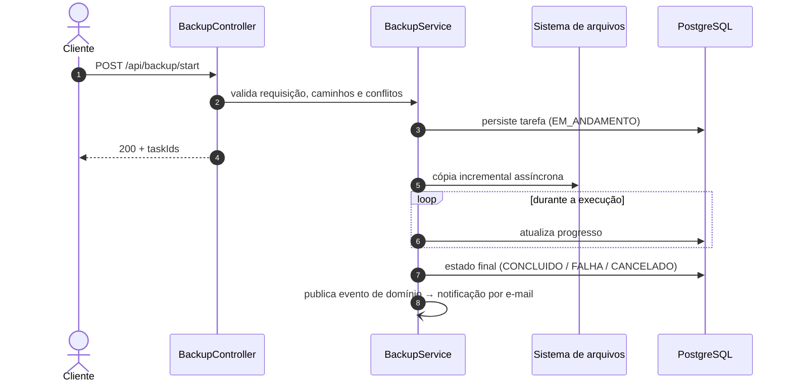

<div align="center">

# Backup Manager

**API e interface web para executar, agendar, restaurar e auditar backups de arquivos com segurança.**

[](https://github.com/devluiscavalcante/backup-manager/actions/workflows/pr-quality-gates.yml)
[](https://github.com/devluiscavalcante/backup-manager/actions/workflows/container-registry.yml)


[](LICENSE)

[Início rápido](#início-rápido) ·
[Funcionalidades](#funcionalidades) ·
[Segurança](#segurança) ·
[API](#referência-da-api) ·
[Configuração](#configuração) ·
[Desenvolvimento](#desenvolvimento)

</div>

---

O **Backup Manager** troca scripts manuais e tarefas soltas do sistema operacional por um serviço HTTP com regras explícitas, controle de acesso e histórico. Ele executa backups sob demanda ou por agendamento, restaura conteúdo de forma completa ou seletiva e registra tudo em PostgreSQL, com progresso em tempo real, notificações por e-mail e trilha de auditoria.

## Funcionalidades

| | |
|---|---|
| **Backups** | Execução sob demanda, cópia incremental, progresso em tempo real, pausa, retomada e cancelamento (inclusive de tarefas ainda na fila). Bloqueia execuções duplicadas para a mesma origem e destino. |
| **Restauração** | Pré-visualização em árvore do conteúdo, restauração completa ou seletiva por arquivo/diretório, opção de sobrescrever e histórico por backup. |
| **Agendamento** | Rotinas recorrentes por expressão cron (validada antes de salvar), execuções únicas futuras, disparo imediato e recarga automática dos agendamentos ativos na inicialização. |
| **Operação** | Health checks da aplicação, do banco e do schema, métricas de armazenamento por unidade, logs e warnings consultáveis e notificações por e-mail. |
| **Auditoria** | Eventos de segurança persistidos, consulta paginada e limpeza com retenção configurável. |
| **Respostas padronizadas** | Todos os erros seguem o mesmo contrato JSON com `code` estável e `requestId` para rastreamento. |

## Início rápido

> [!NOTE]
> Requisitos: **Java 21** e **Docker**. O Maven Wrapper (`./mvnw`) já vem no repositório.

**1. Suba o PostgreSQL**

```bash
docker compose up -d postgres
```

**2. Crie um `.env` na raiz do projeto** (carregado automaticamente)

```env
DB_PASSWORD=postgres

APP_SECURITY_USERNAME=admin
APP_SECURITY_PASSWORD=uma-senha-forte
APP_SECURITY_ALLOWED_PATH_ROOTS=C:\Dados,C:\Backups
```

**3. Rode a aplicação**

```bash
./mvnw spring-boot:run
```

**4. Teste**

```bash
curl http://localhost:8080/api/health/application
```

**5. (Opcional) Abra a interface web** — requer **Node.js 20+**

```bash
cd frontend
npm ci
npm start          # http://localhost:4200 (proxy de /api para :8080)
```

Entre com o usuário e a senha de `APP_SECURITY_USERNAME`/`APP_SECURITY_PASSWORD`. Detalhes em [`frontend/README.md`](frontend/README.md).

> [!TIP]
> Para desenvolvimento local, o perfil `dev` aceita a senha padrão e habilita endpoints de teste do scheduler:
> `./mvnw spring-boot:run -Dspring-boot.run.profiles=dev`

## Exemplos de uso

<details open>
<summary><b>Iniciar um backup</b></summary>

```bash
curl -u admin:uma-senha-forte \
  -X POST http://localhost:8080/api/backup/start \
  -H "Content-Type: application/json" \
  -d '{
    "sources": ["C:\\Dados\\Projetos"],
    "destination": ["C:\\Backups"]
  }'
```

Cada origem é copiada para o destino na mesma posição da lista, e cada par vira uma tarefa. A resposta traz os `taskIds`; acompanhe com `GET /api/backup/progress` ou `GET /api/backup/{taskId}/status`. Se já houver backup ativo para o mesmo par, a API responde `409`.

</details>

<details>
<summary><b>Agendar um backup diário às 2h</b></summary>

```bash
curl -u admin:uma-senha-forte \
  -X POST http://localhost:8080/api/backup/config \
  -H "Content-Type: application/json" \
  -d '{
    "name": "Backup diário",
    "sources": ["C:\\Dados\\Projetos"],
    "destinations": ["C:\\Backups"],
    "cronExpression": "0 0 2 * * *",
    "enabled": true
  }'
```

Valide a expressão antes com `POST /api/backup/config/validate-cron` ou use um dos modelos de `GET /api/backup/config/cron-templates`.

</details>

<details>
<summary><b>Restaurar arquivos específicos</b></summary>

```bash
curl -u operator:senha-do-operador \
  -X POST http://localhost:8080/api/backup/10/restore/selective \
  -H "Content-Type: application/json" \
  -d '{
    "targetPath": "C:\\Dados\\Restaurado",
    "selectedFiles": ["financeiro/relatorio.xlsx"],
    "overwriteExisting": false
  }'
```

Use `GET /api/backup/10/restore/preview` para listar o que existe no backup.

</details>

## Arquitetura

Arquitetura em camadas: os controllers cuidam do contrato HTTP, os serviços de aplicação orquestram as regras, o domínio modela tarefas e eventos e a infraestrutura isola banco, sistema de arquivos e SMTP.


```mermaid
flowchart LR
    Client(["Cliente HTTP"]) --> Filters["Filtros<br/>rastreamento · origem · autenticação"]
    Filters --> Controllers["REST Controllers"]
    Controllers --> Services["Application Services"]
    Services --> Domain["Domínio<br/>tarefas · eventos"]
    Services --> Infra["Infraestrutura"]
    Domain -. eventos .-> Listeners["Listeners<br/>notificações"]
    Infra --> DB[("PostgreSQL")]
    Infra --> FS[("Sistema de arquivos")]
    Listeners --> SMTP[("SMTP")]
```

<details>
<summary><b>Fluxo de um backup</b></summary>


```mermaid
sequenceDiagram
    autonumber
    actor C as Cliente
    participant API as BackupController
    participant S as BackupService
    participant FS as Sistema de arquivos
    participant DB as PostgreSQL

    C->>API: POST /api/backup/start
    API->>S: valida requisição, caminhos e conflitos
    S->>DB: persiste tarefa (EM_ANDAMENTO)
    API-->>C: 200 + taskIds
    S->>FS: cópia incremental assíncrona
    loop durante a execução
        S->>DB: atualiza progresso
    end
    S->>DB: estado final (CONCLUIDO / FALHA / CANCELADO)
    S-)S: publica evento de domínio → notificação por e-mail
```

</details>

<details>
<summary><b>Estrutura de pacotes</b></summary>

```text
src/main/java/com/backup_manager
├── application
│   ├── controller      # endpoints REST
│   ├── dto             # contratos de entrada e saída
│   ├── listener        # reações a eventos de domínio
│   ├── progress        # acompanhamento de progresso
│   └── service         # orquestração de backup, restore, agendamento e auditoria
├── domain
│   ├── event           # início, conclusão, falha e cancelamento
│   ├── exception       # erros de domínio e handler global
│   ├── model           # BackupTask, RestoreTask, ScheduledBackupEntity...
│   └── service         # regras de negócio do backup
└── infrastructure
    ├── config          # segurança, CORS, executores, scheduler, Flyway
    ├── logging
    ├── persistence     # repositórios JPA
    ├── storage         # cópia e restauração no sistema de arquivos
    ├── validation
    └── web             # filtros HTTP (rastreamento, proteção de origem)
```

</details>

## Segurança

A API foi feita para uso administrativo e operacional controlado, não para exposição pública aberta.

**Autenticação e papéis.** HTTP Basic, sem sessão (stateless), com dois perfis:

| Acesso | Rotas |
|---|---|
| Público | `GET /api/health/application` |
| `ADMIN` | `/api/health/**`, `/api/system/**`, `/api/logs/**`, `/api/backup/config/**`, `/api/backup/scheduler/**`, `/api/backup/notifications/**` |
| `ADMIN` ou `OPERATOR` | `/api/backup/**`, `/api/restore/**` |

O usuário `OPERATOR` é opcional e habilitado com `APP_SECURITY_OPERATOR_ENABLED=true`.

**Proteção do sistema de arquivos.** Todo caminho de origem, destino ou restauração passa por validação:

- precisa estar dentro de uma raiz de `APP_SECURITY_ALLOWED_PATH_ROOTS`;
- path traversal (`..`) e áreas protegidas do sistema são bloqueados;
- symlinks e junctions são resolvidos para o caminho real antes da checagem e **não são seguidos** durante cópia, restauração ou contagem de arquivos;
- origem e destino não podem se sobrepor.

**Proteção contra requisições de outra origem.** Escritas (`POST`, `PUT`, `PATCH`, `DELETE`) enviadas por navegador a partir de uma origem fora de `APP_SECURITY_ALLOWED_ORIGINS` recebem `403`, mesmo com credenciais em cache. Clientes fora do navegador, como `curl` e scripts, não são afetados.

> [!WARNING]
> A aplicação **não inicia** com as senhas padrão fora dos perfis `dev` e `test`. Em produção, defina pelo menos `APP_SECURITY_USERNAME`, `APP_SECURITY_PASSWORD` e `APP_SECURITY_ALLOWED_PATH_ROOTS`, com raízes mínimas.

## Referência da API

Toda resposta inclui o cabeçalho `X-Request-Id`. Envie o seu próprio valor nesse cabeçalho para correlacionar logs entre sistemas.

<details>
<summary><b>Backup</b></summary>

| Método | Rota | Descrição |
|---|---|---|
| `POST` | `/api/backup/start` | Inicia um backup |
| `GET` | `/api/backup/progress` | Progresso das tarefas em andamento |
| `GET` | `/api/backup/active` | Tarefas ativas |
| `GET` | `/api/backup/{taskId}/status` | Estado de uma tarefa |
| `POST` | `/api/backup/{taskId}/pause` | Pausa |
| `POST` | `/api/backup/{taskId}/resume` | Retoma |
| `POST` | `/api/backup/{taskId}/cancel` | Cancela (inclusive na fila) |
| `GET` | `/api/backup/history` | Histórico completo |
| `GET` | `/api/backup/history/search` | Busca no histórico |
| `GET` | `/api/backup/history/stats` | Estatísticas |
| `GET` | `/api/backup/history/recent` | Execuções recentes |

</details>

<details>
<summary><b>Restauração</b></summary>

| Método | Rota | Descrição |
|---|---|---|
| `GET` | `/api/backup/{id}/restore/preview` | Árvore de arquivos do backup |
| `POST` | `/api/backup/{id}/restore` | Restauração completa |
| `POST` | `/api/backup/{id}/restore/selective` | Restauração seletiva |
| `GET` | `/api/backup/{id}/restore/history` | Restaurações de um backup |
| `GET` | `/api/restore/{taskId}/status` | Estado de uma restauração |
| `POST` | `/api/restore/{taskId}/cancel` | Cancela |
| `GET` | `/api/restore/history` | Histórico |
| `GET` | `/api/restore/recent` | Restaurações recentes |

</details>

<details>
<summary><b>Agendamento</b> (ADMIN)</summary>

| Método | Rota | Descrição |
|---|---|---|
| `POST` | `/api/backup/config` | Cria ou atualiza uma rotina recorrente |
| `GET` | `/api/backup/config` | Lista rotinas |
| `GET` | `/api/backup/config/{id}` | Detalha uma rotina |
| `PATCH` | `/api/backup/config/{id}/toggle` | Ativa ou desativa |
| `DELETE` | `/api/backup/config/{id}` | Remove |
| `POST` | `/api/backup/config/validate-cron` | Valida expressão cron |
| `GET` | `/api/backup/config/cron-templates` | Modelos de cron |
| `POST` | `/api/backup/scheduler/schedule-once?minutesFromNow=N` | Agenda execução única |
| `GET` | `/api/backup/scheduler/schedule/pending` | Execuções únicas pendentes |
| `DELETE` | `/api/backup/scheduler/schedule/{taskId}/cancel` | Cancela execução única |
| `POST` | `/api/backup/scheduler/execute-now` | Executa imediatamente |
| `GET` | `/api/backup/scheduler/status` | Estado do scheduler |
| `GET` | `/api/backup/scheduler/info` | Informações do scheduler |
| `GET` | `/api/backup/scheduler/health` | Saúde do scheduler |

No perfil `dev` também existem `POST /api/backup/scheduler/test-quick` e `POST /api/backup/scheduler/test-5min`.

</details>

<details>
<summary><b>Operação e auditoria</b> (ADMIN, exceto o health público)</summary>

| Método | Rota | Descrição |
|---|---|---|
| `GET` | `/api/health/application` | Saúde e versão da aplicação (público) |
| `GET` | `/api/health/database` | Saúde do banco |
| `GET` | `/api/system/storage` | Espaço por unidade |
| `GET` | `/api/system/schema` | Diagnóstico do schema e das migrações |
| `GET` | `/api/system/audit` | Eventos de auditoria, com filtros e paginação |
| `POST` | `/api/system/audit/cleanup` | Limpa eventos fora da retenção |
| `GET` | `/api/logs` | Conteúdo do log |
| `GET` | `/api/logs/warnings` | Warnings operacionais |
| `GET` | `/api/backup/notifications/settings` | Configuração de notificações |
| `POST` | `/api/backup/notifications/test` | Envia e-mail de teste |

</details>

<details>
<summary><b>Contrato de erro</b></summary>

```json
{
  "success": false,
  "status": 403,
  "error": "Requisicao de escrita de origem nao permitida.",
  "code": "cross_origin_request_blocked",
  "details": { "method": "POST" },
  "path": "/api/backup/start",
  "requestId": "6f1c2a9e-...",
  "timestamp": "2026-10-09T08:52:02"
}
```

Use `code` para tratar erros no cliente. O texto de `error` pode mudar.

</details>

## Configuração

Todas as opções vêm de variáveis de ambiente ou de um arquivo `.env` na raiz.

<details open>
<summary><b>Banco e servidor</b></summary>

| Variável | Padrão | Descrição |
|---|---|---|
| `DB_HOST` | `localhost` | Host do PostgreSQL |
| `DB_PORT` | `5432` | Porta do PostgreSQL |
| `DB_NAME` | `backup_manager` | Nome do banco |
| `DB_USERNAME` | `postgres` | Usuário do banco |
| `DB_PASSWORD` | *(vazio)* | Senha do banco (`postgres` no `docker-compose.yml`) |
| `APP_PORT` | `8080` | Porta HTTP |
| `APP_VERSION` | versão do build | Versão exibida no health check |

</details>

<details>
<summary><b>Segurança</b></summary>

| Variável | Padrão | Descrição |
|---|---|---|
| `APP_SECURITY_USERNAME` | `admin` | Usuário administrativo |
| `APP_SECURITY_PASSWORD` | `change-me-now` | Senha administrativa |
| `APP_SECURITY_ROLE` | `ADMIN` | Papel administrativo |
| `APP_SECURITY_OPERATOR_ENABLED` | `false` | Habilita o usuário operacional |
| `APP_SECURITY_OPERATOR_USERNAME` | `operator` | Usuário operacional |
| `APP_SECURITY_OPERATOR_PASSWORD` | `change-me-operator` | Senha operacional |
| `APP_SECURITY_OPERATOR_ROLE` | `OPERATOR` | Papel operacional |
| `APP_SECURITY_ALLOW_DEFAULT_PASSWORD` | `false` | Permite iniciar com senhas padrão |
| `APP_SECURITY_ALLOWED_PATH_ROOTS` | diretório do usuário | Raízes permitidas, separadas por vírgula |
| `APP_SECURITY_ALLOWED_ORIGINS` | `http://localhost:4200` | Origens de navegador aceitas (CORS e escrita), separadas por vírgula |

</details>

<details>
<summary><b>Notificações e auditoria</b></summary>

| Variável | Padrão | Descrição |
|---|---|---|
| `NOTIFICATION_ENABLED` | `false` | Habilita notificações por e-mail |
| `NOTIFICATION_EMAIL_FROM` | *(placeholder)* | Remetente |
| `NOTIFICATION_EMAIL_RECIPIENTS` | *(placeholder)* | Destinatários, separados por vírgula |
| `NOTIFICATION_NOTIFY_SUCCESS` | `false` | Notifica backups concluídos |
| `NOTIFICATION_NOTIFY_FAILURE` | `false` | Notifica falhas |
| `MAIL_HOST` | *(placeholder)* | Servidor SMTP |
| `MAIL_PORT` | `465` | Porta SMTP (SSL) |
| `MAIL_USERNAME` | *(placeholder)* | Usuário SMTP |
| `MAIL_PASSWORD` | *(placeholder)* | Senha SMTP |
| `AUDIT_RETENTION_ENABLED` | `true` | Limpeza automática de auditoria |
| `AUDIT_RETENTION_MAX_DAYS` | `90` | Dias de retenção dos eventos |

</details>

**Perfis:** o padrão aplica todas as regras de segurança; `dev` aceita senha padrão e expõe endpoints de teste do scheduler; `test` usa `create-drop` para os testes automatizados.

## Docker

```bash
docker build -t backup-manager .

docker run --rm -p 8080:8080 \
  -e DB_HOST=host.docker.internal \
  -e DB_PASSWORD=postgres \
  -e APP_SECURITY_PASSWORD=uma-senha-forte \
  -e APP_SECURITY_ALLOWED_PATH_ROOTS=/data \
  -v /caminho/no/host:/data \
  backup-manager
```

A imagem usa build multi-stage e roda em `eclipse-temurin:21-jre-alpine` com usuário não root. Imagens publicadas ficam no GitHub Container Registry. Para monitoramento externo, use o endpoint público `GET /api/health/application`.

> [!IMPORTANT]
> No container, `APP_SECURITY_ALLOWED_PATH_ROOTS` deve apontar para caminhos **dentro do container**. Monte os diretórios do host com `-v`.

## Desenvolvimento

**Repositório:** a API fica na raiz (`src/`, `pom.xml`) e a interface Angular em [`frontend/`](frontend/README.md), com build e testes próprios.

**Stack:** Java 21 · Spring Boot 4 (Web MVC, Security, Data JPA, Validation, Mail, Actuator) · Spring Retry · PostgreSQL 15 · Flyway · Lombok · Maven · JaCoCo · Checkstyle

```bash
./mvnw verify                       # build completo com testes e Checkstyle
./mvnw test                         # todos os testes (requer PostgreSQL)
./mvnw test -Dtest=PathSecurityServiceTests
./mvnw jacoco:report                # cobertura em target/site/jacoco
```

> [!NOTE]
> Os testes de integração usam o PostgreSQL do `docker-compose.yml`. Rode com `DB_PASSWORD=postgres` (ou defina no `.env`). Os testes de symlink são pulados no Windows quando o usuário não tem privilégio para criar links.

**Migrações:** versionadas em `src/main/resources/db/migration` e aplicadas pelo Flyway na inicialização. O Hibernate apenas valida o schema (`ddl-auto=validate`).

### CI/CD

| Workflow | Quando roda | O que faz |
|---|---|---|
| `feature-branch-ci.yml` | Push em branches de trabalho | Build rápido |
| `pr-quality-gates.yml` | Pull requests e branches principais | Testes com PostgreSQL, Checkstyle e cobertura |
| `container-registry.yml` | Push em `master` e tags `v*` | Publica a imagem no GHCR |
| `version-release.yml` | Tags `v*.*.*` | Gera a release no GitHub |
| `frontend-ci.yml` | Alterações em `frontend/` | Testes (Vitest) e build de produção do Angular |

### Convenções

- Branches: `feat/`, `fix/`, `refactor/`, `security/`, `perf/`, `test/`, `docs/`, `ci/`, `chore/`
- Commits no formato [Conventional Commits](https://www.conventionalcommits.org/) (`fix: ...`, `feat: ...`)
- Merges na `master` com `--no-ff`

## Limitações conhecidas

- Usuários definidos em configuração (em memória) e autenticação apenas por HTTP Basic.
- Agendamentos dependem da aplicação estar em execução.
- Opera somente sobre sistemas de arquivos acessíveis pelo processo da aplicação.

## Licença

Distribuído sob a licença [MIT](LICENSE).
